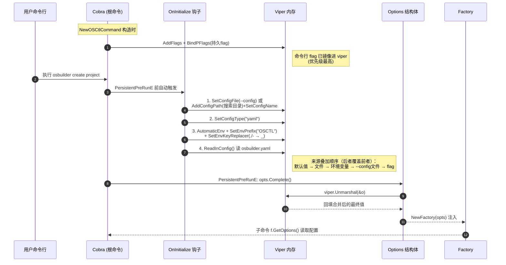

# osbuilder CLI 配置管理

本文档说明 `osbuilder` 命令行工具的配置管理机制：配置从何而来、如何加载、如何贯穿命令树。

> 适用范围：`cmd/osbuilder/osbuilder.go` 入口 → `internal/osbuilder/cmd/cmd.go` 根命令 → `internal/osbuilder/util/options` 配置结构体 → `onexstack/pkg/core.OnInitialize` 加载器。

## 1. 设计概览

osbuilder 的配置管理基于 **Cobra（命令行框架）+ Viper（配置管理库）** 协作实现。

- **入口极薄**：`cmd/osbuilder/osbuilder.go` 的 `main()` 仅构造根命令并运行，不含任何配置逻辑。
- **配置集中**：真正的配置逻辑全部在 `internal/osbuilder/cmd/cmd.go` 的 `NewOSCtlCommand` 中。
- **贯穿命令树**：配置通过 `Factory` 注入到每个子命令构造函数 `NewXxxCmd(f, ioStreams)`，子命令无需关心配置来源。

### 数据流

```
main()
 └─ cmd.NewDefaultOSCtlCommand()
      └─ NewOSCtlCommand(io)
           ├─ opts := clioptions.NewOptions()         // 配置结构体
           ├─ opts.AddFlags(flags)                    // flag → 持久 flag
           ├─ viper.BindPFlags(cmds.PersistentFlags())// 持久 flag 镜像进 viper
           └─ cobra.OnInitialize(core.OnInitialize(...)) // 注册"执行前钩子"
                             │
        [执行任意子命令，如 osbuilder create project]
                             │
                             ▼
     PersistentPreRunE ──► opts.Complete() ──► viper.Unmarshal(&o)
                             ▲
        core.OnInitialize 闭包（先被触发）：
          ├─ ReadInConfig()  读 osbuilder.yaml（搜索目录 或 --config 指定）
          ├─ AutomaticEnv()  读 OSCTL_* 环境变量
          └─ 值就位 → Complete 反序列化回填 Options
                             │
                             ▼
     Factory{opts} 注入子命令 → 子命令读取配置执行业务逻辑
```

## 2. 配置来源与优先级

Viper 的覆盖顺序（后者覆盖前者）：

```
默认值 < osbuilder.yaml（搜索目录） < 环境变量 OSCTL_* < --config 指定文件 < 命令行 flag
```

注意：命令行 flag 通过 `viper.BindPFlags` 已镜像进 viper，因此命令行 flag 优先级最高。

### 搜索目录

`cmd.go` 的 `searchDirs()` 返回两个目录（按序搜索）：

| 目录 | 路径 | 说明 |
|------|------|------|
| Home 目录 | `$HOME/.onexstack` | 即 `~/.onexstack/osbuilder.yaml` |
| 当前目录 | `.` | 即 `./osbuilder.yaml` |

- 配置文件名固定为 `osbuilder.yaml`（`defaultConfigName`，`cmd.go:49`）。
- 默认 home 子目录为 `.onexstack`（`defaultHomeDir`，`cmd.go:50`）。
- 配置文件格式为 YAML（`viper.SetConfigType("yaml")`）。

### 环境变量

- 前缀：`OSCTL`（由 `cmd.go:201` 传入 `"OSCTL"`）。
- 自动读取：`viper.AutomaticEnv()`。
- Key 替换：`.` 和 `-` 替换为 `_`，例如 `user.name` / `user-name` 对应 `OSCTL_USER_NAME`。

### 配置来源优先级时序图

下图展示一次命令执行（如 `osbuilder --config x.yaml create project`）中，各配置来源如何按「后者覆盖前者」的顺序合并进 Viper，最终反序列化回填 `Options`。



**优先级结论**：`默认值 < 文件(~/.onexstack/osbuilder.yaml 或 ./osbuilder.yaml) < 环境变量 OSCTL_* < --config 指定文件 < 命令行 flag`。

> 验证示例见 `examples/osbuilder-simplified/README.md`：文件提供 `alice`，环境变量 `OSCTL_USER_NAME=bob` 覆盖 name，flag `--user.name=carol` 最终胜出。

## 3. 配置结构体

定义于 `internal/osbuilder/util/options/options.go`：

```go
const FlagConfig = "config"

type Options struct {
	Config            string        // --config 指定的文件路径
	UserOptions       *UserOptions  `json:"user" mapstructure:"user"`
	UserCenterOptions *ServerOptions`json:"usercenter" mapstructure:"usercenter"`
	GatewayOptions    *ServerOptions`json:"gateway" mapstructure:"gateway"`
}
```

- 三层业务配置（user / usercenter / gateway）通过 `mapstructure` tag 与 Viper 的 key 对应。
- `config` 字段本身用于指定配置文件路径，不属于业务配置。

### 关键方法

| 方法 | 作用 |
|------|------|
| `NewOptions()` | 构造带默认值的配置结构体 |
| `AddFlags(fs)` | 把 `--config`、`--user.*`、`--gateway.*` 注册为持久 flag |
| `Complete()` | `viper.Unmarshal(&o)` 把已加载的配置回填结构体 |
| `Validate()` | 校验各子配置项 |

## 4. 加载时机：cobra.OnInitialize + core.OnInitialize

根命令构造时注册钩子（`cmd.go:201`）：

```go
cobra.OnInitialize(core.OnInitialize(
	ptr.To(viper.GetString(clioptions.FlagConfig)), // --config 的值（可为空）
	"OSCTL",            // 环境变量前缀
	searchDirs(),       // 搜索目录
	defaultConfigName,  // "osbuilder.yaml"
))
```

`cobra.OnInitialize` 保证 **每个子命令执行前** 自动调用 `core.OnInitialize` 返回的闭包。该闭包（`onexstack/pkg/core/config.go:10`）逻辑：

```go
func OnInitialize(configFile *string, envPrefix string, loadDirs []string, defaultConfigName string) func() {
	return func() {
		if configFile != nil {
			viper.SetConfigFile(*configFile)        // 指定路径优先
		} else {
			for _, dir := range loadDirs {
				viper.AddConfigPath(dir)             // 搜索目录
			}
			viper.SetConfigType("yaml")
			viper.SetConfigName(defaultConfigName)  // osbuilder.yaml
		}
		viper.AutomaticEnv()                        // 读环境变量
		viper.SetEnvPrefix(envPrefix)               // OSCTL_xxx
		viper.SetEnvKeyReplacer(strings.NewReplacer(".", "_", "-", "_"))
		_ = viper.ReadInConfig()                    // 加载（找不到也不报错）
	}
}
```

> 注意：`viper.ReadInConfig()` 的 error 被忽略（`_`），即配置文件不存在时不报错，配置项使用默认值。

## 5. 反序列化回填

在根命令的 `PersistentPreRunE`（`cmd.go:160`）中调用：

```go
opts.Complete()  // viper.Unmarshal(&o)
```

此时 viper 已包含（文件 + 环境变量 + flag）合并后的值，`Unmarshal` 将其回填到 `Options` 结构体。

## 6. 注入子命令

```go
f := cmdutil.NewFactory(opts)   // Options 注入 Factory
```

之后各子命令通过 `f.GetOptions()` 读取配置（真实代码中 `Factory` 还提供更丰富的集群访问能力，此处仅演示配置注入）。

## 7. 关键文件索引

| 职责 | 位置 |
|------|------|
| 入口（无配置逻辑） | `cmd/osbuilder/osbuilder.go:27-33` |
| 建根命令 + 注册 flag + OnInitialize | `internal/osbuilder/cmd/cmd.go:135-205` |
| 配置结构体 + AddFlags + Complete | `internal/osbuilder/util/options/options.go:23-44` |
| 搜索目录定义 | `internal/osbuilder/cmd/cmd.go:306 searchDirs` |
| 文件名/目录常量 | `internal/osbuilder/cmd/cmd.go:49-50` |
| 真正读文件+环境变量 | `onexstack/pkg/core/config.go:10 OnInitialize` |
| 注入子命令 | `internal/osbuilder/cmd/cmd.go:204 cmdutil.NewFactory(opts)` |
| `osbuilder options` 帮助子命令（非配置） | `internal/osbuilder/cmd/options/options.go:22 NewCmdOptions` |

## 8. 两个 `options` 包的区别

原仓库存在两个同名 `options` 包，容易混淆，**职责完全不同**：

| 维度 | `cmd/options`（命令行选项） | `util/options`（配置项） |
|------|------------------------------|---------------------------|
| 包路径 | `internal/osbuilder/cmd/options` | `internal/osbuilder/util/options` |
| 含义 | "options" = 命令行选项（同 flags） | "options" = 配置项（同 config settings） |
| 作用 | `osbuilder options` 子命令：打印所有命令继承的持久 flag | 全局配置结构体：定义 `--config`/`--user.*` 等并绑定 viper |
| 导出物 | `NewCmdOptions(out) *cobra.Command` | `type Options`、`NewOptions()`、`AddFlags`、`Complete`、`Validate` |
| 与配置关系 | 无关（只调 `cmd.Usage()` 做 help 展示） | 是（`osbuilder.yaml` 的 user/usercenter/gateway 配置） |
| 简化版位置 | `examples/osbuilder-simplified/internal/cmd/options/options.go` | `examples/osbuilder-simplified/internal/util/options/options.go` |

> 简化版 `cmd.go` 中因两者同名，给配置包起了别名 `clioptions`（`import clioptions "internal/util/options"`），与原仓库 `cmd.go` 的写法一致。

```bash
# 打印所有命令继承的持久 flag（来自 cmd/options，非配置读取）
osbuilder options
```

## 9. 使用示例

```bash
# 1. 使用默认搜索目录中的配置文件 ~/.onexstack/osbuilder.yaml
osbuilder create project

# 2. 指定配置文件
osbuilder --config /path/to/osbuilder.yaml create project

# 3. 环境变量覆盖（优先级高于文件）
OSCTL_USER_NAME=alice osbuilder create project

# 4. 命令行 flag 覆盖（优先级最高）
osbuilder create project --user.name=alice
```

## 10. 领域配置 vs 全局配置（何时该放进 `Options`）

并非所有配置都适合放进全局 `Options`（`util/options`）。判断标准：

- **全局配置**：整条 CLI 启动时就需要、所有子命令共享的基础设施。
  例如 `--config` 路径、`user`（操作用户身份）、`usercenter`/`gateway`（后端服务地址）。
  它们挂在根命令 `PersistentFlags`，经 `BindPFlags` + `OnInitialize` 统一加载，并通过 `Factory.GetOptions()` 注入。
- **领域配置（子命令级）**：只服务于某一个具体子命令、与业务资源强相关的连接信息。
  例如「连接 ES 管理 ES 资源」所需的地址、索引、认证。其他子命令（`create`/`version`/`color`）完全用不到。
  若塞进全局 `Options`，会让根命令 flag 表无限膨胀，也违背配置分层解耦的设计。

**落地范式**（简化版 `es` 命令即此范例）：

| 维度 | 全局配置 | es 领域配置 |
|------|---------|------------|
| 结构体 | `internal/util/options/options.go` 的 `Options` | `internal/cmd/es/options/options.go` 的 `ESOptions` |
| flag 挂载位置 | 根命令 `PersistentFlags`（`opts.AddFlags(flags)`） | 子命令自身 `cmd.Flags()`（`o.AddFlags(cmd.Flags())`） |
| viper 镜像 | `BindPFlags(cmds.PersistentFlags())`（构造期） | `BindPFlags(cmd.Flags())`（构造期） |
| 是否被 `Factory.GetOptions()` 暴露 | 是 | 否（es 命令自己持有 `ESOptions`） |
| 是否污染其他子命令 flag 表 | 全局可见 | 仅 `es` 子命令可见 |

> 关键：领域配置的 key 用前缀隔离（如 `es.addr`），环境变量对应 `OSCTL_ES_ADDR`。
> `es get` 的 `Complete(cmd)` 手动合并「flag 值（含默认值） < 文件 es.* < 环境变量 OSCTL_ES_* < flag 显式值」，
> 与全局优先级规则完全一致。注意 viper v1.19 的 `UnmarshalKey` 不会读取 `BindPFlags` 注册的 flag 默认值，
> 故领域配置改用「flag 解析值兜底 + viper 显式 `IsSet` 覆盖」实现合并。

### es 命令示例

```bash
# 领域配置默认值来自 NewESOptions()：addr=http://localhost:9200 index=default
osbuilder es get

# 命令行 flag 覆盖（es.* 前缀，最高优先级）
osbuilder es get --es.addr=http://es.prod:9200 --es.index=orders

# 环境变量覆盖（OSCTL_ES_* 前缀，. 转 _）
OSCTL_ES_ADDR=http://es.prod:9200 osbuilder es get --es.index=orders

# 配置文件覆盖（osbuilder.yaml 的 es.* 段）
cat > osbuilder.yaml <<'EOF'
es:
  addr: http://es.file:9200
  index: fileidx
  username: fileuser
EOF
osbuilder es get
```

简化版源码位置：`internal/cmd/es/es.go`（中间节点）、`internal/cmd/es/get/get.go`（叶子）、`internal/cmd/es/options/options.go`（领域配置）。

## 11. 简化版与真实实现对齐状态

> 本节记录 `examples/osbuilder-simplified` 相对 `internal/osbuilder/cmd` 真实实现的覆盖情况。
> 完整的分阶段对齐路线图见 [`cli-alignment-plan.md`](./cli-alignment-plan.md)。

### 11.1 配置管理相关对齐表

| 能力 | 真实实现 (`internal/osbuilder/cmd`) | 简化版 (`examples/osbuilder-simplified`) | 状态 |
|------|--------------------------------------|------------------------------------------|------|
| 根命令分组 + AddCommand | `cmd.go` | `internal/cmd/cmd.go` | ⚠️ 已对齐核心，缺 profiling/插件/headers |
| 全局 `Options` 结构体 | `util/options/options.go`（含 User/Usercenter/Gateway 完整字段） | `internal/util/options/options.go`（字段裁剪） | ⚠️ 字段被精简，见 §11.2 |
| `AddFlags` + `BindPFlags` | `opts.AddFlags(flags)` + `viper.BindPFlags(cmds.PersistentFlags())` | 同 | ✅ |
| 配置加载（文件/环境变量） | `core.OnInitialize` | `internal/cmd/util/config.go` 的 `OnInitialize`（复刻） | ✅ |
| `--config` flag | `cmd.go:201` 构造期 `ptr.To(viper.GetString(...))` **失效（bug）** | 延迟求值 `func() *string` **已修复** | ✅ 简版更优 |
| 领域配置（子命令级） | 无专门范例 | `internal/cmd/es/*`（教学新增） | ✅ 简版独有 |
| `Factory.GetOptions()` 注入 | `cmd/util/factory.go` | `internal/cmd/util/factory.go` | ✅ |
| `osbuilder options` 帮助子命令 | `cmd/options/options.go` | `internal/cmd/options/options.go` | ✅ |
| Profiling 标志 | `cmd/profiling.go` + `PersistentPreRunE` | 无 | 🔲 待对齐（计划阶段 B） |
| warnings-as-errors | `cmd.go` flag + `PersistentPostRunE` | 无 | 🔲 待对齐（计划阶段 B） |
| Command Headers RoundTripper | `addCmdHeaderHooks`（`OSCTL_COMMAND_HEADERS`） | 无 | 🔲 待对齐（计划阶段 B） |
| 插件机制 (`plugin`) | `genericcmd.HandlePluginCommand` | 无（刻意省略） | 🚫 不纳入 |

### 11.2 全局 `Options` 字段差异（简化版 → 真实版）

简版为降低认知负担，仅保留 `user.username` 与 `usercenter/gateway.addr` 作为代表字段，
真实版字段更完整（完整清单见 `cli-alignment-plan.md` §2）：

- `UserOptions`：简版仅 `username`；真实版另有 `token` / `password` / `secret-id` / `secret-key` / `client-certificate` / `client-key`。
- `ServerOptions`：简版用 `addr`；真实版用 `address`（flag 名不同），并另有 `insecure-skip-tls-verify` / `certificate-authority` / `timeout` / `max-retries` / `retry-interval`。

### 11.3 已知差异与取舍

1. **`--config` 加载**：真实版 `cmd.go:201` 在构造期求值 `--config`，因 flag 未解析取到空字符串，
   导致 `--config` 指定的文件被静默丢弃（已记入工作记忆，待后续修复）。
   简版改为延迟求值 `func() *string`，已验证生效。**对齐时不要回退到真实版写法**。
2. **`ServerOptions.addr` vs `address`**：简版为直观用 `addr`，对齐真实版时建议改为 `address` 以完全兼容。
3. **插件机制**：真实版依赖 kubectl 插件加载，与配置管理教学无关，简版刻意不纳入。
4. **`create` 语义**：简版用 `create project` 演示业务命令；真实版实际是 `create cmd`（脚手架生成器），
   两者都演示 Options 模式，对齐路线图中规划为阶段 C 改为真实语义。

### 11.4 验证要点回顾

- 全局配置优先级：`flag 默认值 < osbuilder.yaml 的 user.* < 环境变量 OSCTL_USER_* < flag 显式值`。
- 领域配置（`es`）优先级：`flag 默认值 < osbuilder.yaml 的 es.* < 环境变量 OSCTL_ES_* < flag 显式值`。
- `osbuilder options` 只展示全局继承 flag（`user.*` / `config`），**不**展示 `es.*`，证明领域配置解耦成功。
- `--config` 在简版中已修复，可显式指定任意路径的配置文件。
